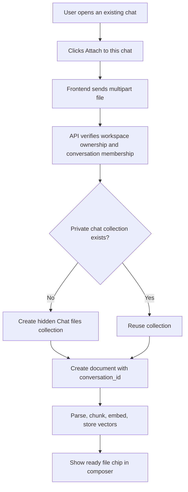
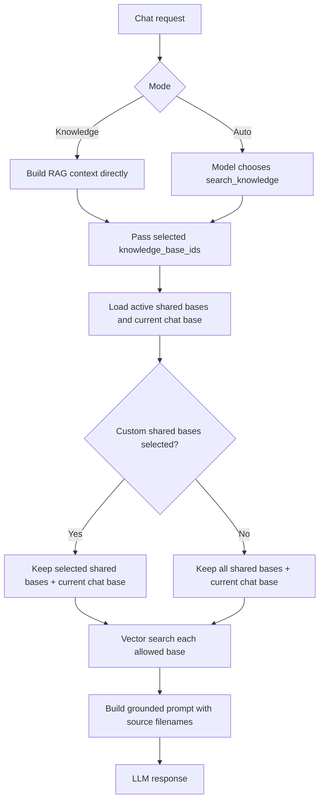

# Chat knowledge and private attachments

This guide explains which documents Chat may read, how a selected knowledge base is enforced, and how files attached directly to one conversation remain private to that conversation.

## The two document scopes

| Scope | Created from | Available in | Visible on Knowledge page | Deleted with chat |
|---|---|---|---|---|
| Shared knowledge base | Knowledge page | Any chat in the workspace when selected | Yes | No |
| Chat attachment | Paperclip in a conversation | Only that conversation | No | Yes |

Selecting a shared knowledge base does not disable chat attachments. The effective search scope is:

```text
One or more knowledge bases selected
          +
Files attached to this conversation
          |
          v
Allowed vector searches for this message
```

The composer provides three choices:

- **All** searches every active shared knowledge base.
- **Multiple** searches only the checked shared knowledge bases.
- **None** searches no shared knowledge base.

Chat attachments remain a separate private scope, so they are still available when shared knowledge is set to None. Another conversation's attachments are never included.

## Upload flow



Code entry points:

- UI and upload state: [`ChatAttachments.tsx`](../frontend/src/components/ChatAttachments.tsx)
- Frontend requests: [`services.ts`](../frontend/src/lib/services.ts)
- Authenticated upload/list endpoints: [`conversations.py`](../backend/app/api/v1/routes/conversations.py)
- File validation and indexing: [`document_service.py`](../backend/app/services/document_service.py)
- Parse/chunk/embed pipeline: [`pipeline.py`](../backend/app/rag/pipeline.py)

Accepted formats are PDF, DOCX, TXT, Markdown, and CSV. The current size limit is 25 MB. Indexing currently runs synchronously, so a large upload can take time before the request completes.

## Retrieval flow



The central enforcement point is [`ChatService._build_rag_context`](../backend/app/services/chat_service.py). Both the non-streaming Auto path and streaming path forward `knowledge_base_ids` and `conversation_id` into this method. This prevents a UI selection from being lost inside tool calling.

## Storage and deletion

`knowledge_bases.conversation_id` identifies the one hidden vector collection owned by a conversation. `documents.conversation_id` identifies the files shown in that chat. Both foreign keys use `ON DELETE CASCADE`, so deleting a conversation removes its private collection, document metadata, and chunks.

Shared list queries explicitly require `conversation_id IS NULL`. This keeps chat attachments out of the Knowledge page and hidden chat collections out of its collection selector.

Database definitions:

- [`knowledge_base.py`](../backend/app/models/knowledge_base.py)
- [`document.py`](../backend/app/models/document.py)
- [`conversation.py`](../backend/app/models/conversation.py)
- [Conversation document migration](../backend/alembic/versions/a7b8c9d0e1f2_add_conversation_scoped_documents.py)

## API endpoints

| Method | Endpoint | Purpose |
|---|---|---|
| `GET` | `/workspaces/{workspace_id}/conversations/{conversation_id}/documents` | List only this chat's files |
| `POST` | `/workspaces/{workspace_id}/conversations/{conversation_id}/documents` | Upload and index a private chat file |
| `DELETE` | `/workspaces/{workspace_id}/documents/{document_id}` | Remove a document owned by the workspace |
| `POST` | `/workspaces/{workspace_id}/conversations/{conversation_id}/messages` | Send `knowledge_base_ids` with the prompt |

`knowledge_base_ids` has explicit semantics: `null` means All, `[]` means None, and an array of UUIDs means only those selected shared collections. The older singular `knowledge_base_id` remains accepted for backward compatibility.

Every endpoint first verifies that the signed-in user owns the workspace. The conversation lookup also requires the conversation to belong to that workspace.

## Deploying this change

After pulling or deploying this version, apply the database migration before testing attachments:

```powershell
cd backend
alembic upgrade head
```

On Render, the normal pre-deploy migration command should run this automatically if it is already configured. Verify the deployment logs show revision `a7b8c9d0e1f2`.

## Product behavior to test

1. Create shared bases A and B with clearly different facts.
2. In Chat, select A and ask for the fact stored only in B. Chat must not cite B.
3. Attach a third file to Chat 1 and ask about it. Chat 1 should use it.
4. Open Chat 2 and ask for the attached fact. Chat 2 must not retrieve it.
5. Delete Chat 1 and confirm its attached files are no longer listed.

Automated regression coverage lives in [`test_chat_knowledge_scope.py`](../backend/tests/test_chat_knowledge_scope.py).

## Blindspot Agent

The new **Blindspot Agent** is a differentiated planning agent. It does more than summarize or research: it extracts hidden assumptions, ranks them by uncertainty and impact, runs a pre-mortem, checks external claims, and proposes the cheapest reversible tests before the user commits resources.

Its template and prompt are defined in [`agentTemplates.ts`](../frontend/src/lib/agentTemplates.ts). It uses existing audited tools, so it adds a new workflow without adding another external service or secret.
