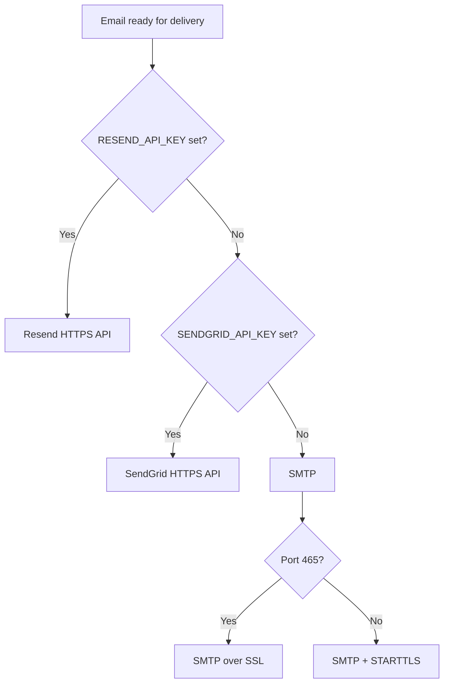
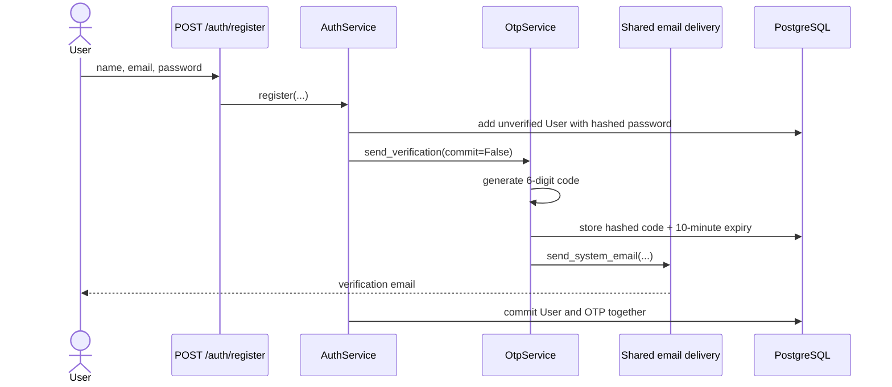
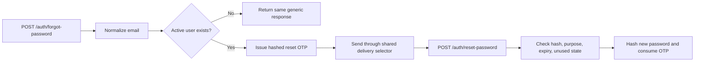

# Email delivery

Suvyon has two email-producing features:

1. **Authentication email** sends verification and password-reset one-time codes.
2. **Agent email tools** let an LLM prepare an email and, only after explicit user approval, send it.

Both paths ultimately use the same delivery selector in [`backend/app/tools/email_tool.py`](../backend/app/tools/email_tool.py#L248). They differ in who is allowed to request delivery.

## Delivery provider selection

The backend chooses exactly one transport for each email, in this order:



The code does not load-balance or fail over from Resend to SendGrid/SMTP after a provider rejects a message. A configured Resend key always takes priority; SendGrid is considered only when Resend is not configured; SMTP is considered only when neither HTTPS API key is configured.

| Priority | Transport | Required settings | Network path |
|---:|---|---|---|
| 1 | Resend | `RESEND_API_KEY` and `SMTP_FROM_EMAIL` (or `SMTP_USERNAME`) | HTTPS `POST https://api.resend.com/emails` |
| 2 | SendGrid | `SENDGRID_API_KEY` and `SMTP_FROM_EMAIL` (or `SMTP_USERNAME`) | HTTPS `POST https://api.sendgrid.com/v3/mail/send` |
| 3 | SMTP | Host/from/password; username when the server requires login | Port 587 with STARTTLS or port 465 with SSL |

Important details:

- `SMTP_FROM_EMAIL` is the sender address for **all three transports**, despite its SMTP-oriented name. If it is empty, `SMTP_USERNAME` is used.
- A Gmail username can imply `smtp.gmail.com` when `SMTP_HOST` is empty.
- Gmail uses a 16-character App Password. Spaces and surrounding quotes are removed before login.
- SMTP has an 8-second connection timeout. Resend and SendGrid requests have a 20-second timeout.
- If Gmail on port 587 fails for a reason other than a blocked/unreachable port, the code makes one SSL attempt on port 465.
- Resend and SendGrid responses with HTTP status 400 or higher become delivery errors. Provider message IDs are not currently persisted.

## Authentication email flow

Authentication email is a **system-controlled transactional path**. It does not require a chat confirmation because registering, resending a verification code, or requesting a password reset is itself the explicit request for that transactional message.

### Registration and verification



Step by step:

1. [`POST /auth/register`](../backend/app/api/v1/routes/auth.py#L25) calls [`AuthService.register`](../backend/app/services/auth_service.py#L32).
2. The email is normalized, uniqueness is checked, and a User is added with a hashed password and `is_verified=False`.
3. [`OtpService.send_verification`](../backend/app/services/otp_service.py#L59) first verifies that at least one email transport is configured.
4. A cryptographically generated six-digit code is created. Any older active code for the same email and purpose is consumed.
5. Only a password hash of the code is stored in `otp_codes`; the plaintext code exists only while building the email.
6. The code expires after 10 minutes. Another code cannot be sent for 60 seconds.
7. [`send_system_email`](../backend/app/tools/email_tool.py#L203) validates the message and calls the shared provider selector.
8. Registration uses `commit=False`, so AuthService commits the new User and OTP record together after delivery succeeds. If delivery raises an exception, the database work is rolled back.
9. [`POST /auth/verify-email`](../backend/app/api/v1/routes/auth.py#L86) compares the submitted code with the stored hash, checks expiry and unused state, consumes it, and sets `is_verified=True`.

One consistency limitation remains: delivery occurs before the database commit. If the provider accepts the email but the later database commit fails, the user can receive a code that was not committed. A durable outbox/worker design would close this gap.

### Forgot-password and reset



- [`request_password_reset`](../backend/app/services/otp_service.py#L90) silently does nothing for an unknown or inactive account; the API still returns a generic response to reduce account enumeration.
- Verification codes and reset codes have different `purpose` values, so one cannot be used for the other.
- A successful reset consumes the code and stores a hash of the new password.
- The service checks that email delivery is configured before looking up the account. Therefore a completely unconfigured mail system returns an operational error rather than the generic success response.

## Agent email-tool flow

Agent email is an **LLM-proposed side-effect path**. It requires explicit confirmation outside the model prompt.

```mermaid
sequenceDiagram
    actor User
    participant Runner as Agent runner
    participant LLM
    participant Draft as draft_email
    participant Send as send_email
    participant Mail as Shared email delivery

    User->>Runner: Compose an email
    Runner->>LLM: Instructions + tool schemas
    LLM-->>Runner: draft_email arguments
    Runner->>Draft: validate and format
    Draft-->>User: Draft; not sent
    User->>Runner: send it
    Runner->>LLM: History + confirmation
    LLM-->>Runner: send_email arguments
    Runner->>Send: arguments + exact current user text
    Send->>Send: validate recipient, subject, body, confirmation
    Send->>Mail: deliver
    Mail-->>Runner: verified success or error
    Runner-->>User: final result
```

Step by step:

1. The saved Agent contains comma-separated allowed tool names. [`_get_agent_tools`](../backend/app/agents/runner.py#L63) intersects them with the real registry.
2. [`get_tool_schemas`](../backend/app/tools/registry.py#L160) exposes `draft_email` and/or `send_email` schemas to the LLM.
3. The LLM proposes a structured call. It does not execute Python or contact an email provider.
4. [`_call_tool`](../backend/app/agents/runner.py#L109) normalizes recipient/subject/body and passes the exact current user message as `user_content` when dispatching `send_email`.
5. [`draft_email`](../backend/app/tools/email_tool.py#L139) validates and returns formatted text. It never calls a transport.
6. [`send_email`](../backend/app/tools/email_tool.py#L153) independently validates the address, non-empty subject/body, and explicit confirmation.
7. Compose phrases such as “send an email to…” are deliberately not confirmation. Accepted confirmations include exact words such as “yes” or “confirm” and phrases such as “send it” or “please send.”
8. If confirmation is absent, the function returns `BLOCKED` plus the draft and does not open SMTP or call an HTTPS provider.
9. After confirmation, it calls the same `_deliver_email` selector used by authentication emails and returns success only after that call succeeds.

This is defense in depth: the agent system prompt instructs the model to draft first, and the Python email function enforces confirmation again. Current confirmation is based on phrases in the latest user message; it is not a durable approval tied to a hash of a persisted draft. Idempotency keys and delivery reconciliation are also not implemented.

## Shared versus different behavior

| Concern | Authentication email | Agent email tool |
|---|---|---|
| Content | Fixed verification/reset template | LLM-generated recipient, subject, and body |
| User confirmation | Auth API request authorizes the transaction | Separate explicit send confirmation required |
| Delivery selector | Resend → SendGrid → SMTP | Resend → SendGrid → SMTP |
| Sender address | `SMTP_FROM_EMAIL`, else `SMTP_USERNAME` | Same |
| Database storage | Hashed OTP metadata; not plaintext body | No email-delivery/history record; chat may contain draft/result |
| Failure result | Auth request fails and transaction rolls back | Tool returns a readable error and draft |
| Provider ID stored | No | No |

## Local and production configuration

### Local development

The usual local path is Gmail SMTP:

```text
SMTP_HOST=smtp.gmail.com
SMTP_PORT=587
SMTP_USERNAME=you@gmail.com
SMTP_PASSWORD=your-16-character-app-password
SMTP_FROM_EMAIL=you@gmail.com
```

Gmail requires 2-Step Verification and an App Password; a normal Gmail password will not work.

### Render production

Render free web services cannot normally reach outbound SMTP ports 25, 465, or 587. Use an HTTPS provider:

```text
RESEND_API_KEY=re_...
SMTP_FROM_EMAIL=Suvyon <verified-sender@example.com>
```

or:

```text
SENDGRID_API_KEY=SG....
SMTP_FROM_EMAIL=verified-sender@example.com
```

Set these on the **Render backend**, not Vercel. The sender/domain must satisfy the selected provider's verification rules.

`backend/render.yaml` declares `RESEND_API_KEY` and `SENDGRID_API_KEY` as externally supplied secrets. It does not currently declare `SMTP_FROM_EMAIL`, so that sender value must be added manually in the Render dashboard unless the blueprint is updated. The repository cannot reveal which secret is populated in the live Render environment; confirm it in the Render dashboard. Because of provider precedence, setting both keys selects Resend.

## Failure checklist

1. Confirm the variables are set on Render, not Vercel.
2. Confirm `SMTP_FROM_EMAIL` is set and accepted by Resend/SendGrid.
3. Remember that a configured Resend key prevents SendGrid/SMTP from being tried.
4. Inspect the returned provider status/error. The backend includes up to 400 characters of an HTTPS provider's rejected response.
5. For local Gmail, use a 16-character App Password and port 587 or 465.
6. Check spam and wait at least 60 seconds before requesting another OTP.
7. Confirm the `otp_codes` Alembic migration is deployed.

## Tests that prove current behavior

- [`backend/tests/test_email_tools.py`](../backend/tests/test_email_tools.py) verifies draft-only behavior, confirmation blocking, SMTP send, Gmail password cleanup, Render timeout guidance, and Resend-over-HTTPS priority.
- [`backend/tests/test_agent_runner.py`](../backend/tests/test_agent_runner.py#L61) verifies that an agent cannot send on an initial compose request.
- [`backend/tests/test_otp_auth.py`](../backend/tests/test_otp_auth.py) verifies six-digit hashed codes, expiry, resend limits, reset consumption, and clear failure when delivery is unconfigured.

The tests mock network delivery. They do not send real email or prove the current live provider configuration.
