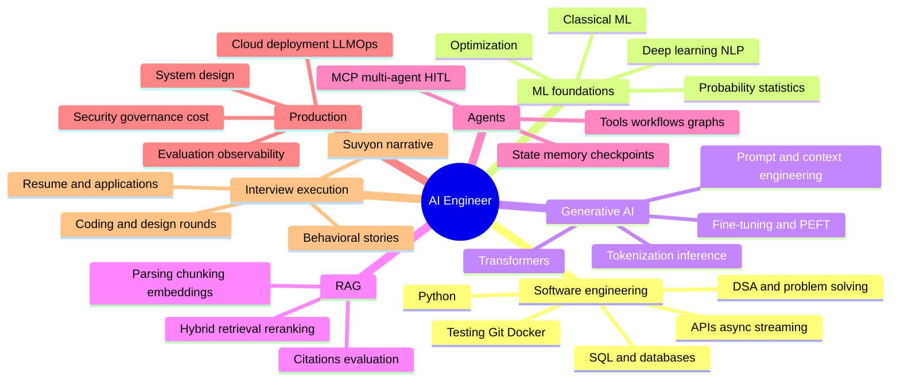

# Complete GenAI and Agentic AI Job Study Plan

## The honest promise

No plan can guarantee an offer or 100% interview clearance. Interview outcomes also depend on the role level, company-specific rounds, competition, communication, and chance. This plan instead gives you a measurable standard: do not call yourself ready until you consistently pass the readiness gates at the end of this document.

Assumption: **12 weeks, 18–20 focused hours per week**. If you can study 10 hours, take 20–24 weeks. If you already have strong Python/backend and ML fundamentals, compress it to 8 weeks by passing the relevant gates early—never by skipping untested topics.

## Why this scope matches the market

Recent job descriptions consistently combine strong Python and backend engineering with RAG, agent workflows, evaluation, observability, safety, latency, and cost. Several also ask for graph orchestration, streaming, cloud platforms, and MCP—not merely prompt writing. Examples: [Accenture Federal Services](https://job-boards.greenhouse.io/accenturefederalservices/jobs/4669272006), [Wipro](https://careers.wipro.com/job/Bengaluru-Generative-AI-Engineer-with-Python-IND-560035/180169-en_US/), [EPAM](https://careers.epam.com/en/vacancy/senior-ai-engineer-agentic-and-rag-systems-blty5mp8mok8tyd6a36_en), and [EY](https://careers.ey.com/ey/job/Kolkata-Agentic-AI-Evaluation-Engineer-WB-700091/1408185133/).

## Complete interview surface

## Before week 1: baseline assessment

Take this closed-book in 150 minutes. Record the date and score; do not study first.

1. Write Python functions for an LRU cache and cosine similarity (35 minutes).
2. Solve one array/hash-map medium problem and one SQL join/window-function problem (35 minutes).
3. Explain attention, embeddings, RAG, tool calling, and hallucination aloud (20 minutes).
4. Draw Suvyon chat, RAG, and agent flows from memory (20 minutes).
5. Design a safe document assistant at 100 requests/second (25 minutes).
6. Give the two-minute Suvyon pitch and one STAR story (15 minutes).

Score each section from 0–5: correctness, completeness, clarity, trade-offs, and evidence. Any section below 3 receives extra time in the weekly plan.

## Weekly operating rhythm

| Day | Time | Work |
|---|---:|---|
| Monday | 2.5h | Theory, handwritten mental model, 10 verbal questions |
| Tuesday | 2.5h | Coding/SQL plus small implementation |
| Wednesday | 2.5h | Trace and explain relevant Suvyon code/tests |
| Thursday | 2.5h | Build/experiment and record results |
| Friday | 2h | Timed technical questions and spaced repetition |
| Saturday | 5h | Weekly deliverable, system design, or project improvement |
| Sunday | 2h | Mock interview, retrospective, plan weak areas |

Every study session must produce evidence: code, a diagram, measured experiment, flashcards, a recorded explanation, or a scored mock. Passive video watching does not count as completion.

## Week 1 — Python, APIs, SQL, and problem solving

Learn:

- Python data structures, mutability, comprehensions, iterators/generators, decorators, context managers, exceptions, typing, dataclasses, Pydantic, packaging, and pytest.
- Async/event loop, blocking versus non-blocking I/O, threads/processes, cancellation, and streaming.
- REST semantics, authentication versus authorization, pagination, idempotency, rate limiting, structured errors, SSE versus WebSocket.
- SQL joins, grouping, CTEs, window functions, transactions, isolation, indexing, query plans, and N+1 queries.
- Big-O plus arrays, strings, hash maps, stacks/queues, heaps, trees, graphs, binary search, BFS/DFS, and basic dynamic programming.

Suvyon lab: trace one route through dependency → service → repository → database, then trace the streaming message endpoint. Read [Engineering Foundations](../05-system-design/ENGINEERING_FOUNDATIONS.md).

Deliverable: 12 coding problems, 8 SQL problems, a typed FastAPI endpoint with tests, and a five-minute explanation of async pitfalls.

Gate: solve two unseen easy/medium coding problems and one SQL problem in 60 minutes with correct complexity analysis.

## Week 2 — Mathematics, machine learning, and deep learning

Learn:

- Vectors, matrices, dot products, norms, cosine similarity, gradients, and matrix multiplication shapes.
- Probability, conditional probability, Bayes rule, expectation, variance, common distributions, sampling, confidence intervals, and hypothesis testing.
- Train/validation/test split, leakage, bias/variance, overfitting, regularization, class imbalance, and cross-validation.
- Regression/classification, trees/ensembles, clustering, PCA, precision/recall/F1, ROC-AUC versus PR-AUC, calibration.
- Neural networks, activations, loss functions, backpropagation, gradient descent/Adam, batch size, learning rate, dropout, normalization.

Suvyon lab: derive cosine distance used by pgvector and explain why retrieval evaluation needs train/dev/test query sets.

Deliverable: implement linear regression or a small classifier without a high-level training API; create a metric-selection cheat sheet.

Gate: explain overfitting, leakage, regularization, gradient descent, precision/recall, and cosine similarity using examples without notes.

## Week 3 — NLP, transformers, and LLM inference

Learn:

- Text normalization, subword tokenization, vocabulary, embeddings, positional encoding.
- Query/key/value attention, masking, multi-head attention, residuals, normalization, feed-forward blocks.
- Encoder-only, decoder-only, and encoder-decoder architectures.
- Pretraining, instruction tuning, preference optimization, RLHF/DPO concepts.
- Autoregressive inference, KV cache, batching, quantization, speculative decoding concepts, temperature/top-k/top-p.
- Context windows, lost-in-the-middle, model capability/cost/latency trade-offs.

Suvyon lab: explain the provider-neutral `LLMMessage`, `LLMResponse`, streaming, and why application-owned history permits provider switching. Read [GenAI Foundations](../01-foundations/GENAI_FOUNDATIONS.md).

Deliverable: draw a transformer from memory and implement scaled dot-product attention with arrays/tensors.

Gate: deliver a ten-minute transformer explanation and answer 15 follow-ups with at least 80% accuracy.

## Week 4 — Prompting, context engineering, model APIs, and fine-tuning choices

Learn:

- Instruction hierarchy; zero/few-shot patterns; decomposition; structured output and schema validation.
- Prompt templates, versioning, caching, context selection/compression, and conversation summarization.
- Hallucination, grounding, abstention, output validation, and prompt regression testing.
- When to use prompting, RAG, tools, fine-tuning, LoRA/PEFT, or a deterministic solution.
- Provider API differences: messages, tool calls, streaming, errors, token usage, retries, and model capabilities.

Suvyon lab: compare the Groq, Gemini, and OpenRouter adapters. Trace system instructions and synthesis prompts in the agent runner and chat service.

Deliverable: a 20-case prompt evaluation dataset with rubric; compare two prompt versions and report failures rather than cherry-picking examples.

Gate: choose the correct technique for 10 scenarios and justify quality, freshness, latency, cost, privacy, and maintenance.

## Week 5 — RAG fundamentals

Learn:

- Parsing and document cleaning; chunk size/overlap and structure-aware chunking.
- Document/query embeddings, vector dimensions, cosine/dot/L2 distance.
- Exact versus approximate search; HNSW/IVF intuition; metadata filtering and tenant isolation.
- Top-k, thresholds, source metadata, context construction, citations, and abstention.
- Retrieval metrics: recall@k, precision@k, MRR, nDCG; answer relevance, faithfulness, citation correctness.

Suvyon lab: trace upload → parser → chunker → embeddings → pgvector, then query → retrieve → prompt. Run the chunker and diversity tests. Read [RAG Guide](../02-rag/RAG_INTERVIEW_GUIDE.md).

Deliverable: create at least 30 labeled question/evidence pairs for a small corpus and evaluate Suvyon retrieval before changing any settings.

Gate: diagnose five planted RAG failures and distinguish retrieval failure from generation failure.

## Week 6 — Advanced RAG and information retrieval

Learn:

- BM25/sparse search, hybrid retrieval, reciprocal rank fusion, query rewriting/expansion.
- Cross-encoder reranking, contextual compression, parent-child retrieval, multi-query and multi-hop retrieval.
- Table/code/image/OCR retrieval concepts, knowledge graphs and GraphRAG trade-offs.
- Index versioning, incremental updates, deduplication, deletion, ACL propagation, cache invalidation.
- RAG security: poisoned documents, indirect prompt injection, sensitive vector data, cross-tenant leakage.

Suvyon lab: design (and ideally implement in a branch) BM25/hybrid retrieval or a lightweight reranking stage. Compare it on the Week 5 dataset.

Deliverable: a before/after evaluation report containing quality, latency, and complexity—not just screenshots.

Gate: whiteboard an enterprise RAG platform with ingestion, ACLs, evaluation, observability, and failure recovery in 35 minutes.

## Week 7 — Agents, tools, workflows, and safety

Learn:

- Agent versus chain/workflow; tool schemas; ReAct; routing; planning/execution; reflection trade-offs.
- State machines/graphs, termination, budgets, repeated-call detection, error recovery.
- Tool argument validation, authorization, sandboxing, allowlists, timeout/retry, idempotency, audit.
- Human-in-the-loop preview/approval and compensating actions.
- Working, episodic, semantic, and procedural memory; summarization versus retrieval.

Suvyon lab: trace `run_agent` and auto-chat orchestration. Explain the email confirmation boundary and tests. Read [Agentic AI Guide](../03-agents/AGENTIC_AI_INTERVIEW_GUIDE.md).

Deliverable: build a bounded agent with three mocked tools, typed state, budgets, repeated-call detection, and trajectory tests.

Gate: respond safely and correctly to malformed calls, a failing tool, repeated calls, prompt injection in tool output, and a side-effect request.

## Week 8 — Graph orchestration, multi-agent systems, and MCP

Learn:

- Durable execution, checkpoints, interrupts, replay, branches, parallel nodes, and resumability.
- When multi-agent specialization helps and when it creates coordination/context/evaluation overhead.
- Supervisor, handoff, debate, map-reduce, and blackboard patterns.
- MCP architecture: host, client, server; tools, resources, prompts; discovery and transport; capability negotiation and authorization.
- MCP security: server trust, tool poisoning, confused deputy, scope creep, context injection, and credential isolation.

The current MCP specification lets servers expose model-invokable tools, while graph runtimes emphasize checkpoints for fault tolerance and human pauses. Study the [official MCP tool specification](https://github.com/modelcontextprotocol/modelcontextprotocol/blob/main/docs/specification/2026-07-28/server/tools.mdx) and [LangGraph persistence concepts](https://langchain-ai.github.io/langgraph/concepts/time-travel/).

Suvyon lab: map the existing tool registry onto an MCP server design. Do not replace the current registry until you can articulate the interoperability benefit and security boundary.

Deliverable: implement a small local MCP server with one read-only resource and two narrow tools, plus authorization/threat notes.

Gate: explain MCP versus function calling and design a safe connection to a company data source.

## Week 9 — Evaluation, observability, security, and responsible AI

Learn:

- Golden sets, synthetic-data limits, deterministic checks, human rubrics, pairwise evaluation, LLM-as-judge calibration.
- Component versus end-to-end evaluation; agent trajectory evaluation; red teaming and adversarial suites.
- Online feedback, A/B/canary/shadow releases, drift/regression detection, prompt/model/data versioning.
- Traces, metrics, logs, request/run correlation, time to first token, p95/p99, tokens, cost, task success.
- OWASP risks: prompt injection, sensitive disclosure, supply chain/poisoning, improper output handling, excessive agency, prompt leakage, vector weaknesses, misinformation, unbounded consumption.
- Bias, transparency, privacy, retention, consent, and human oversight.

The current OWASP guidance specifically covers excessive agency and vector/embedding weaknesses, both directly relevant to Suvyon. OpenTelemetry provides standardized semantic conventions for telemetry. See [OWASP GenAI risks](https://genai.owasp.org/llm-top-10/?cat=253) and [OpenTelemetry conventions](https://opentelemetry.io/docs/specs/semconv/).

Suvyon lab: design an eval dataset and trace schema for chat, RAG, and agent runs. Identify sensitive fields that must be redacted.

Deliverable: an automated evaluation harness with at least 40 cases across normal, edge, adversarial, and safety behavior.

Gate: a candidate prompt/model/tool change cannot “ship” unless the harness passes defined thresholds and you can explain its remaining blind spots.

## Week 10 — Production AI, cloud, Docker, and LLMOps

Learn:

- Docker images, environment/secrets, CI/CD, backward-compatible migrations, object storage, queues/workers, caches.
- Stateless APIs, autoscaling, database pooling, backpressure, retries with jitter, circuit breakers, bulkheads, dead-letter queues.
- Managed model endpoints versus self-hosted inference; GPU memory/throughput basics; batching and quantization trade-offs.
- At least one cloud deeply: AWS, Azure, or GCP—identity, networking, compute, storage, managed databases, monitoring, and one managed AI platform.
- Cost estimation and budgets across tokens, embeddings, storage, retrieval, tools, and repeated agent calls.

Suvyon lab: study the Vercel/Render/Supabase deployment. Design durable object storage and asynchronous ingestion with exact states and retry behavior. Read [Production Design](../05-system-design/PRODUCTION_DESIGN.md).

Deliverable: Dockerize or verify the stack, write a deployment diagram, SLOs, alerts, incident scenario, and rough capacity/cost model.

Gate: explain how you would handle a provider outage, database saturation, stuck ingestion jobs, token-cost spike, and partial streaming failure.

## Week 11 — System design and the Suvyon defense

Practice designs:

1. Enterprise document assistant with ACL-aware RAG.
2. Research agent with citations and budgets.
3. Customer-support copilot with human escalation.
4. Safe email/calendar agent.
5. Code assistant with sandboxed execution.
6. Multi-tenant AI platform with provider routing.

For each: clarify requirements, estimate load, draw the system, define APIs/data, deep-dive AI quality and safety, handle failures, define metrics, and state trade-offs.

Suvyon lab: master [Suvyon Architecture](../04-suvyon-deep-dive/SUVYON_ARCHITECTURE.md), including what is implemented versus aspirational. Prepare 30-second, 2-minute, and 10-minute versions.

Deliverable: six timed whiteboards and a code-tour playlist: one route, chat orchestration, provider adapter/router, RAG, agent loop, authorization, and representative tests.

Gate: score at least 4/5 for requirements, architecture, AI depth, reliability/security, and communication in three consecutive unseen designs.

## Week 12 — Interview execution, behavioral stories, and applications

Prepare:

- Eight STAR stories: hardest bug, failure, trade-off, ambiguity, disagreement, learning quickly, ownership, and security/quality improvement.
- Resume claim defense: every bullet must have context, personal action, evidence, trade-off, and follow-ups.
- Recruiter, coding, ML/LLM theory, RAG/agent, system design, project deep-dive, hiring-manager, and behavioral rounds.
- Company-specific preparation: product, AI stack, job requirements, likely design domain, and thoughtful questions.

Use [Question Bank](../06-question-bank/QUESTIONS_AND_ANSWERS.md) and [Mock Interview Kit](../07-practice/MOCK_INTERVIEW.md).

Deliverable: five full mock loops with recordings/feedback, a role-specific resume, a concise portfolio README, and a targeted application tracker.

Gate: pass all final readiness gates below.

## Final readiness scorecard

Do not rely on “I finished the course.” Use observable performance.

| Area | Required evidence | Pass standard |
|---|---|---|
| Python/DSA | 40 recent timed problems across core patterns | 80% correct; medium in ≤35 minutes |
| SQL | 25 queries including windows/CTEs | 85% correct without hints |
| ML/LLM theory | randomized verbal bank | ≥85%, concise definitions plus mechanism |
| RAG | labeled retrieval/eval project | metrics, failure analysis, measured improvement |
| Agents | bounded tested workflow | tools, state, recovery, HITL, safety, eval |
| MCP/frameworks | small working integration | explain protocol/framework without buzzwords |
| Production | deployment and operations design | SLOs, tracing, failure/cost/security plan |
| System design | five unseen prompts | three consecutive scores ≥20/25 |
| Suvyon | pitch, diagrams, code tour, limitations | no unsupported claims; handle 20 follow-ups |
| Behavioral | eight STAR stories | specific personal actions; no invented metrics |
| Mock interviews | at least 10 mixed mocks | last five average ≥85%, none below 75% |

## Weekly progress tracker

Copy this row for every week:

| Week/date | Planned hours | Focused hours | Deliverable link | Gate score | Top 3 weaknesses | Next actions |
|---|---:|---:|---|---:|---|---|
| | | | | | | |

## What not to do

- Do not collect framework names without understanding the underlying loop/state/retrieval mechanisms.
- Do not present screenshots as evaluation.
- Do not memorize answers word-for-word; interviewers probe reasoning.
- Do not overclaim Suvyon features because a dependency, model, or architecture document mentions them.
- Do not postpone coding, SQL, deployment, security, or behavioral practice until the final week.
- Do not wait for “perfect readiness” before applying; begin targeted applications around Week 8 and use real feedback to reprioritize.

## Ongoing maintenance after Week 12

AI tooling changes quickly. Each month, sample 10 target job descriptions, count repeated requirements, and update 20% of the plan based on evidence. Keep fundamentals stable, but refresh model/provider APIs, frameworks, MCP, security guidance, and cloud offerings from official documentation. Continue two coding sessions, one system design, one Suvyon code tour, and one mock interview every week until an offer is accepted.

