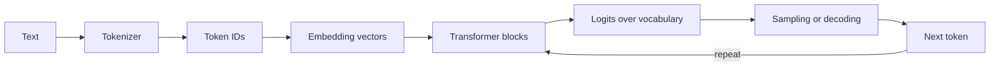

# GenAI Foundations

## The mental model

A large language model estimates the probability of the next token given previous tokens. A chat product turns messages into a model-specific request, runs inference, and converts generated tokens back into text. The model is not a database and does not inherently verify truth.

## Concepts you must explain

### Tokens and context window

A token is a model's unit of text. The context window is the maximum input plus output token budget for one inference call. More context is not automatically better: irrelevant context adds cost, latency, and distraction. Suvyon reconstructs messages from stored history before calling a provider, demonstrating that conversation state lives in the application rather than the LLM.

### Embeddings

An embedding maps text to a dense numerical vector whose geometry approximates semantic similarity. Similar meanings should have nearby vectors. RAG embeds chunks and the query into the same space, then retrieves close vectors. Embeddings do not generate prose; generation models do.

Cosine similarity is:

$$\text{cosine}(a,b)=\frac{a\cdot b}{\|a\|\|b\|}$$

pgvector's `<=>` operator returns cosine **distance**, so lower is better. Suvyon enforces distance thresholds in [vector_store.py](../../backend/app/rag/vector_store.py#L67).

### Transformer and self-attention

Self-attention lets each token form a weighted combination of other token representations. For query, key, and value matrices:

$$\text{Attention}(Q,K,V)=\text{softmax}(QK^T/\sqrt{d_k})V$$

Multi-head attention learns several relationship patterns in parallel. Positional information is required because plain attention has no inherent word order. The feed-forward layer transforms each position; residual connections and normalization stabilize deep networks.

Interview distinction: training computes gradients and updates weights; inference uses fixed weights to generate output.

### Decoding controls

- **Temperature:** rescales logits; lower is more deterministic, higher is more diverse.
- **Top-k:** sample only among the k most probable tokens.
- **Top-p:** sample from the smallest set whose cumulative probability reaches p.
- **Max tokens:** caps generation length and cost.
- **Stop sequences:** terminate on application-defined patterns.

Do not say temperature “adds creativity.” More precisely, it changes the probability distribution and therefore output variance.

### Hallucination

A hallucination is unsupported or false generated content. It arises because next-token likelihood is not truth verification. Mitigations include retrieval, constrained outputs, tools, citations, explicit abstention, deterministic validation, and evaluation. RAG reduces hallucination but cannot eliminate it: bad retrieval can confidently ground a wrong answer.

### Prompt hierarchy

System instructions define behavior; developer/application instructions add constraints; user content supplies the task; tool results supply external observations. Treat retrieved documents and web pages as untrusted data, not instructions, to resist prompt injection.

Useful patterns:

- State role, task, constraints, and desired output schema.
- Provide only relevant context with clear delimiters.
- Include positive examples when format is difficult.
- Ask the model to abstain when evidence is missing.
- Validate structured output with a schema rather than trusting prose instructions.

### In-context learning, RAG, and fine-tuning

| Technique | Changes weights? | Adds current knowledge? | Best for |
|---|---:|---:|---|
| Prompting | No | Only supplied context | Instructions and small examples |
| RAG | No | Yes | Private or frequently changing facts |
| Fine-tuning | Yes | Not reliably | Style, behavior, task specialization |
| Tool calling | No | Via external execution | Actions and deterministic/live data |

Fine-tuning should not be your first choice for keeping facts current. Use RAG for knowledge and tools for actions.

### Training vocabulary

- **Pretraining:** self-supervised learning over large corpora.
- **Instruction tuning / SFT:** supervised examples teach task-following behavior.
- **Preference optimization:** align outputs using human or synthetic preferences (for example RLHF or DPO-family methods).
- **Quantization:** reduce numeric precision to lower memory and improve inference speed, with possible quality loss.
- **Distillation:** train a smaller model to imitate a stronger model.
- **LoRA/PEFT:** adapt a model by training a small number of additional parameters.

### LLM evaluation

Evaluate a system, not just a model. Use a versioned dataset with representative, adversarial, and edge cases.

- Task metrics: exact match, F1, pass@k, schema validity.
- RAG metrics: context precision/recall, answer relevance, faithfulness, citation correctness.
- Agent metrics: task success, tool selection accuracy, invalid tool-call rate, steps, side-effect errors.
- Operational metrics: latency p50/p95/p99, time to first token, tokens, cost, errors, rate limits.
- Human review: correctness, completeness, clarity, safety.

LLM-as-a-judge scales evaluation but can be biased. Calibrate it against human labels, randomize answer order, use explicit rubrics, and periodically audit disagreement.

## Suvyon connections

- Provider-neutral message and response types: [base.py](../../backend/app/ai/providers/base.py#L7)
- Runtime provider registry: [registry.py](../../backend/app/ai/registry.py#L1)
- Model resolution and failover: [router.py](../../backend/app/ai/router.py#L54)
- Persistent conversation messages: [message.py](../../backend/app/models/message.py#L22)
- Embedding provider selection: [embeddings.py](../../backend/app/rag/embeddings.py#L54)

## Rapid-fire answers

**Why can the same prompt produce different answers?** Sampling, provider/model differences, hidden implementation details, and upstream model updates introduce variance.

**What is grounding?** Constraining an answer to supplied, inspectable evidence such as retrieved documents or tool results.

**What is a model adapter?** A provider-specific implementation behind a common interface, allowing business logic to remain provider-neutral.

**Why stream tokens?** It reduces perceived latency and exposes time-to-first-token improvements, though it complicates errors, cancellation, persistence, and tool calling.

**What is structured output?** Output constrained or validated against a schema so downstream software can consume it reliably.

