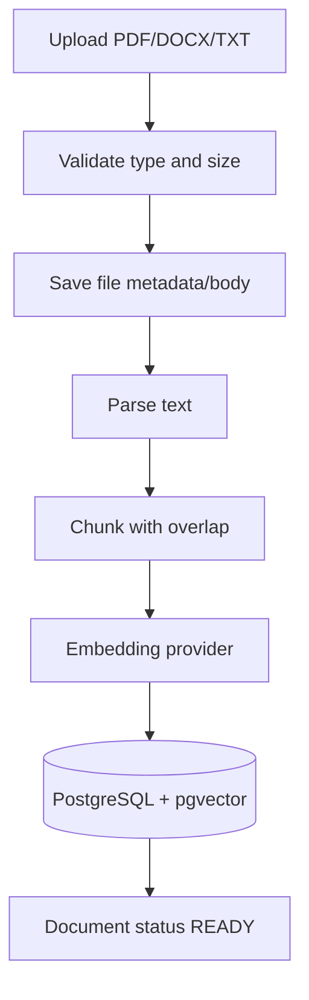
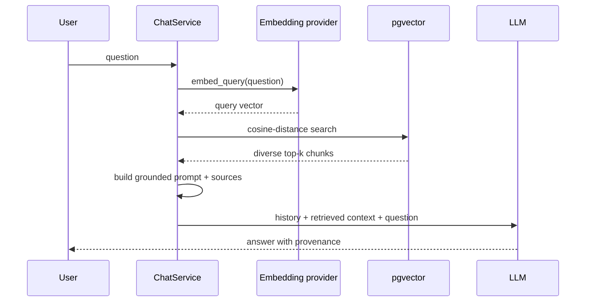
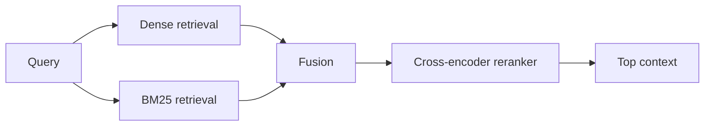

# RAG Interview Guide

## Definition

Retrieval-Augmented Generation retrieves relevant external evidence at inference time and supplies it to a generative model. It separates knowledge storage from language generation, making private and changing information usable without retraining model weights.

## Suvyon ingestion path

Code path:

1. The document service validates and starts processing: [document_service.py](../../backend/app/services/document_service.py#L18).
2. The pipeline parses, chunks, embeds, and stores: [pipeline.py](../../backend/app/rag/pipeline.py#L23).
3. Chunk boundaries are controlled in [chunker.py](../../backend/app/rag/chunker.py#L24).
4. Gemini is preferred and OpenRouter is the fallback embedding provider: [embeddings.py](../../backend/app/rag/embeddings.py#L54).
5. Vectors are stored on `DocumentChunk.embedding`: [chunk.py](../../backend/app/models/chunk.py#L14).

## Suvyon query path

Retrieval and prompt assembly live in [retriever.py](../../backend/app/rag/retriever.py#L62). Similarity search, distance filtering, and cross-document diversification live in [vector_store.py](../../backend/app/rag/vector_store.py#L67).

## Chunking trade-offs

Chunks that are too small lose context; chunks that are too large dilute semantic focus and consume tokens. Overlap protects facts crossing boundaries but duplicates storage and may cause redundant retrieval. Better production strategies include structure-aware splitting by headings, tables, code blocks, and semantic boundaries, plus storing document/page/section metadata.

Suvyon uses deterministic text chunking with overlap. This is explainable and inexpensive, but a good improvement would be format-aware chunking and an evaluation-based choice of chunk size rather than intuition alone.

## Retrieval design

Dense retrieval captures semantic similarity. Sparse/BM25 retrieval handles exact names, codes, identifiers, and rare terms. Hybrid retrieval combines both, then a reranker scores candidates more precisely.

Suvyon currently uses dense cosine search, a maximum-distance threshold, and diversification across documents. It does not currently implement BM25 or a learned reranker. State that distinction clearly.

## Why Suvyon diversifies results

Naive top-k may return five near-duplicate chunks from one document. Suvyon first selects the best chunk from each distinct document, then fills remaining positions by rank. This improves source coverage. See `_diversify_chunk_ids` adjacent to [similarity_search](../../backend/app/rag/vector_store.py#L67) and its tests in [test_rag_diversity.py](../../backend/tests/test_rag_diversity.py#L12).

## Thresholds and abstention

Top-k always returns something unless filtered. A maximum distance threshold prevents clearly unrelated context from entering the prompt. However, a fixed threshold is corpus- and embedding-dependent. Calibrate it on labeled query–document pairs and monitor no-answer rate versus false-grounding rate.

## RAG evaluation

Build a dataset of `(question, expected evidence, reference answer)`.

| Layer | Question | Metric |
|---|---|---|
| Ingestion | Was content parsed and segmented correctly? | parse success, chunk coverage |
| Retrieval | Did expected evidence appear? | recall@k, MRR, nDCG |
| Context | Is retrieved text relevant and non-redundant? | precision@k, diversity |
| Generation | Is the answer supported? | faithfulness, correctness |
| Citation | Does each citation support its claim? | citation precision/coverage |
| Operations | Is it usable and affordable? | p95 latency, tokens, cost, failures |

Do retrieval evaluation separately from answer evaluation. A good answer can hide bad retrieval through model memory, while bad generation can waste excellent retrieval.

## Failure diagnosis

| Symptom | Likely cause | Fix |
|---|---|---|
| Relevant document never appears | parser/chunker/embedding mismatch | inspect extracted text; tune chunking; verify same embedding model |
| Correct chunk ranks low | semantic ambiguity | query rewriting, hybrid retrieval, reranking |
| Many duplicates | overlapping chunks dominate | deduplicate/diversify, reduce overlap |
| Confident unsupported claim | permissive prompt/model prior | strict grounding, citations, claim verification, abstention |
| Empty results on small corpus | approximate index behavior | exact scan for small corpora; Suvyon disables index scans below a threshold |
| Old answers after document update | stale embeddings/cache | version documents and re-index atomically |

## Security

- Enforce workspace/tenant filters in every retrieval query.
- Treat document text as untrusted; retrieved instructions must not override system policy.
- Validate upload type by content, not filename only; scan malware; limit decompression and parsing resources.
- Apply access-control changes to indexes immediately.
- Avoid exposing sensitive chunks in logs or traces.
- Support deletion across file, metadata, chunks, backups, and caches.

## Strong interview answer

“Suvyon’s RAG pipeline parses an upload, creates overlapping chunks, embeds them, and stores vectors in PostgreSQL with pgvector. At query time it embeds the question, applies cosine-distance search with a relevance threshold, diversifies results across documents, and builds a grounded prompt with source labels. The pragmatic advantage is one transactional database for app and vector data. The main limitations are synchronous ingestion, dense-only retrieval, fixed thresholds, and no reranker. I would add background jobs, structure-aware chunking, hybrid search, reranking, and a labeled evaluation suite before tuning.”

