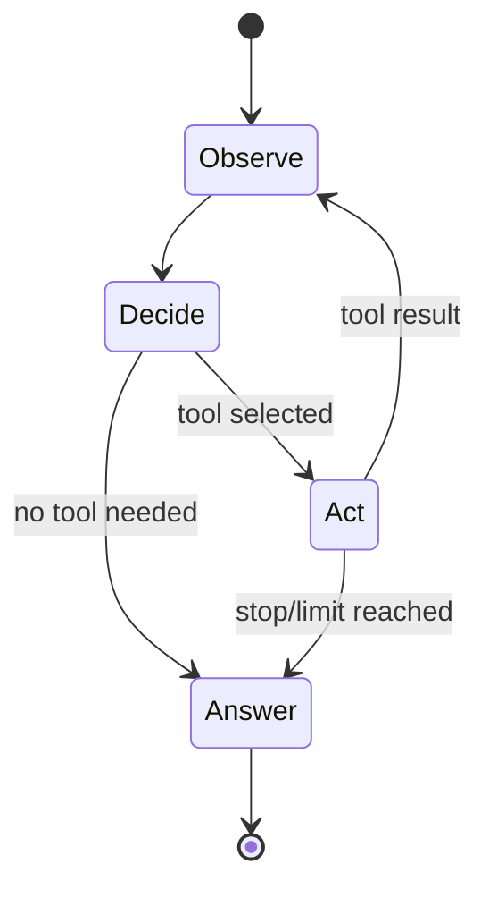
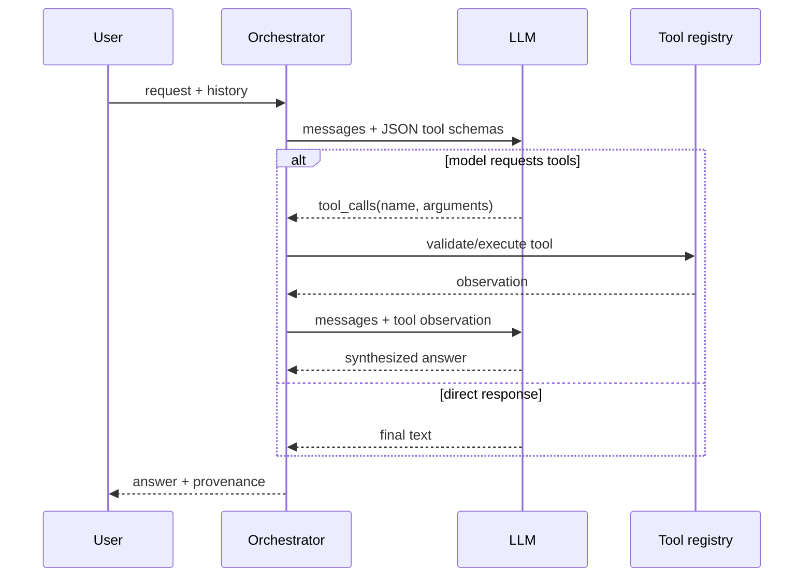

# Agentic AI Interview Guide

## What makes a system agentic?

An agent uses a model to choose actions, observes tool results, updates state, and repeats until it reaches a termination condition. A single prompt-response call is generative AI but is not usually an agent. A deterministic workflow may use an LLM without delegating control decisions to it.

## Core components

- **Policy/model:** chooses an answer or tool call.
- **Tools:** typed, constrained capabilities.
- **State:** conversation, observations, plan, budgets, and artifacts.
- **Orchestrator:** executes calls and controls the loop.
- **Termination:** success, no tool call, maximum steps, timeout, or error budget.
- **Guardrails:** validation, authorization, approval, and output checks.
- **Observability:** traces model choices, tools, latency, tokens, and failures.

## Suvyon's two orchestration paths

Suvyon has general chat auto-mode in [chat_service.py](../../backend/app/services/chat_service.py#L246) and saved agents in [runner.py](../../backend/app/agents/runner.py#L240).

The registry converts Python functions into provider-compatible JSON schemas: [registry.py](../../backend/app/tools/registry.py#L160). The runner caps its loop using `MAX_ITERATIONS`, preventing unbounded cost and looping. After tools run it disables further tool calls for synthesis, which makes termination more predictable.

## ReAct, planning, and workflows

ReAct interleaves reasoning/action decisions and observations. In production, hidden chain-of-thought is not required; store concise action rationale and structured state instead. Plan-and-execute first creates a plan and then performs steps, useful for longer tasks but vulnerable to stale plans. Graph/workflow systems explicitly define nodes and transitions, improving testability and recovery.

Choose the least autonomous design that solves the problem:

| Design | Use when | Main advantage |
|---|---|---|
| Direct LLM | no external state/action | simplest, fastest |
| LLM + one tool | bounded lookup/calculation | easy to validate |
| Deterministic workflow | known business process | predictable and auditable |
| Agent loop | next action depends on observations | flexible |
| Multi-agent | genuine role/context parallelism | specialization, at high complexity cost |

Do not claim multi-agent merely because there are multiple saved agent configurations. Suvyon currently executes one configured agent per run.

## Tool design

A good tool has a narrow purpose, typed parameters, explicit errors, stable semantics, timeouts, and permission checks. Tool output should be compact and structured. Descriptions are part of the model's decision surface: ambiguous descriptions cause wrong calls.

Tool execution must distrust arguments. Validate types and values, enforce authorization outside the model, and limit network/filesystem scope. For state-changing operations, use idempotency keys, dry-run/preview, approval, and audit logs.

Suvyon's email policy is a useful human-in-the-loop example: draft first; send only after explicit confirmation. The orchestration suffix, execution checks, and tests make the boundary stronger than prompt instructions alone. See [runner.py](../../backend/app/agents/runner.py#L1) and [test_email_tools.py](../../backend/tests/test_email_tools.py#L12).

## Agent memory

- **Working memory:** current messages/tool observations.
- **Episodic memory:** prior events or summaries.
- **Semantic memory:** durable facts, often retrieved via vector search.
- **Procedural memory:** policies, skills, or workflows.

Conversation history is not unlimited memory. It eventually exceeds the context window and contains irrelevant content. Production strategies include recent-window retention, summarization with provenance, entity/fact extraction, and retrieval over past events. Suvyon has persistent message history and memory models, but its active orchestration is primarily conversation-history based; do not overstate long-term memory behavior.

## Reliability patterns

- Maximum steps, time, tokens, and spend.
- Per-tool timeout, retry with backoff/jitter, and circuit breaker.
- Idempotency for actions.
- Schema validation and repair for malformed calls.
- Checkpoint state before long or side-effecting steps.
- Compensating action where transactions are impossible.
- Model fallback that preserves messages and tool-call compatibility.
- Explicit partial-success response instead of fabricated completion.

## Threats

**Prompt injection:** untrusted content attempts to alter policy. Separate instructions from data, restrict tool permissions, filter/label content, and require approval for impact.

**Excessive agency:** tools or credentials permit more action than needed. Apply least privilege per user, workspace, tool, and run.

**Data exfiltration:** model sends secrets to a tool or output. Redact secrets, isolate tenants, use destination allowlists, and trace sensitive data flow.

**Confused deputy:** the agent is authorized broadly but acts for an insufficiently authorized user. Every tool must receive trusted identity/context and independently authorize the action.

## Agent evaluation

Measure final task success and trajectory quality:

- correct tool selection and parameter accuracy;
- unnecessary calls and steps;
- recovery from tool errors;
- adherence to confirmation policies;
- grounding in observations;
- time, tokens, and cost;
- deterministic replay success with mocked tool outputs.

Unit-test tools and routing separately, then integration-test complete trajectories. Suvyon's agent, intent-router, email, and model-router tests demonstrate this layering in [backend/tests](../../backend/tests/).

## Strong interview answer

“Suvyon's agent is a bounded tool-calling loop. It builds provider-neutral messages, gives the model schemas only for the configured tools, executes requested calls through a registry, appends observations, and asks the model to synthesize a final answer. It caps iterations and disables tools during final synthesis to prevent loops. External side effects such as email require confirmation. I would next add per-run durable checkpoints, authorization context inside every tool, structured traces, idempotency keys, and trajectory-level evaluations.”

