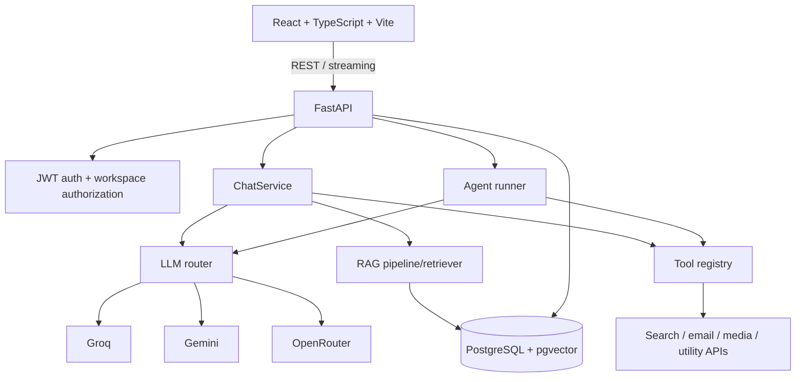
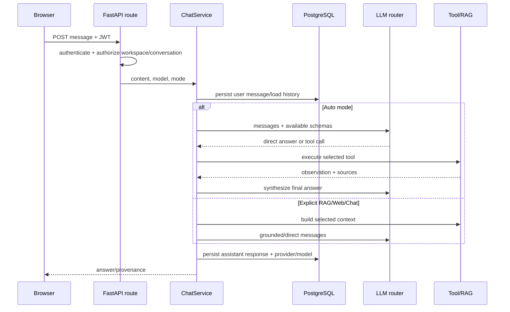
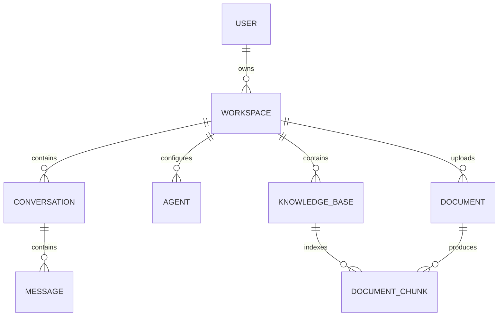

# Suvyon Architecture and Interview Narrative

## One-line description

Suvyon is a multi-LLM AI workspace that combines conversational AI, document-grounded RAG, live-information tools, and configurable tool-using agents behind a React/FastAPI application.

## Runtime architecture

## Code map

| Concern | Implementation | What to say |
|---|---|---|
| App composition | [main.py](../../backend/app/main.py#L1) | FastAPI factory registers middleware, handlers, and versioned routes |
| Frontend chat | [ChatPage.tsx](../../frontend/src/pages/ChatPage.tsx#L1) | React Query manages server state; UI exposes provider/model/mode |
| API client | [api.ts](../../frontend/src/lib/api.ts#L1) | Central Axios client and auth/error handling |
| Chat orchestration | [chat_service.py](../../backend/app/services/chat_service.py#L61) | Persists history, chooses explicit or auto mode, invokes RAG/tools/LLM |
| Provider interface | [base.py](../../backend/app/ai/providers/base.py#L7) | Normalizes messages, responses, streaming, model metadata |
| Provider registry | [registry.py](../../backend/app/ai/registry.py#L1) | Availability derives from configured adapters |
| Routing/failover | [router.py](../../backend/app/ai/router.py#L54) | Explicit selection, model ownership validation, aliases, sequential fallback |
| Agent loop | [runner.py](../../backend/app/agents/runner.py#L240) | Bounded tool loop, observations, final synthesis |
| Tool schemas | [tools/registry.py](../../backend/app/tools/registry.py#L10) | Central mapping from functions to descriptions/JSON schemas |
| RAG ingestion | [pipeline.py](../../backend/app/rag/pipeline.py#L23) | Parse → chunk → embed → pgvector |
| RAG retrieval | [retriever.py](../../backend/app/rag/retriever.py#L62) | Query embedding → similarity search → context/source assembly |
| Vector ranking | [vector_store.py](../../backend/app/rag/vector_store.py#L67) | Cosine distance, threshold, small-corpus handling, diversity |
| Tenant root | [workspace.py](../../backend/app/models/workspace.py#L19) | Conversations, agents, documents, and KBs belong to workspaces |
| API tests | [backend/tests](../../backend/tests/) | Tests cover tools, routing, RAG diversity, OTP, and agent behavior |

## Chat request lifecycle

The key distinction is that “auto” delegates tool choice to the model, while explicit modes make the application choose the context path. That provides both convenience and user control.

## Multi-LLM routing

The provider abstraction avoids leaking vendor SDK objects into services. The router:

1. normalizes retired model aliases;
2. honors an explicit provider;
3. verifies a model belongs to that provider;
4. selects provider defaults when needed;
5. attempts alternative configured providers after failure.

What it does **not** yet do: live health scoring, latency/cost optimization, capability matrices, circuit breakers, or persistent routing telemetry. Existing architecture documents describe some of these as goals, not current behavior.

## Data ownership

Workspace ownership is the tenant boundary. In an interview, emphasize that authentication proves identity while authorization checks whether that identity may access the requested workspace/resource. Foreign keys and cascades preserve relational ownership, but route/service/repository filters must enforce access on every request.

## Design decisions and trade-offs

### FastAPI modular monolith

Good for a portfolio/early product: one deployable unit, typed schemas, simple transactions, and low operational overhead. Modules separate routes, services, repositories, AI, RAG, and tools. Split services only when scaling, ownership, or reliability data justifies it.

### PostgreSQL plus pgvector

One database provides transactions, relational filters, backups, and vector search. It is simpler than operating a separate vector database. At very large vector scale or specialized search requirements, a dedicated service may provide better indexing and independent scaling.

### Provider-neutral adapters

This reduces lock-in and centralizes failover, but providers do not have identical tool-calling, streaming, context, and safety semantics. The common interface must expose capabilities or the abstraction becomes leaky.

### Synchronous document processing

Simple and immediately consistent, but upload latency and request timeouts grow with file size. Production evolution: object storage, job queue, worker, idempotent indexing stages, progress states, retry/dead-letter handling, and atomic activation of the new index version.

## Honest gap analysis

- Uploads are staged on local server storage and deleted after synchronous indexing, so the original source file is not durably retained for reprocessing or audit; production should use durable object storage.
- RAG is dense-only and lacks a reranker and formal evaluation suite.
- Agent state is not durably checkpointed between steps.
- Tool error handling often converts exceptions to strings; production needs typed error classes and retry policy.
- Provider failover is sequential but not health-, cost-, or latency-aware.
- There is no dedicated distributed queue/cache/observability backend.
- Security needs continuing hardening for prompt injection, outbound tool allowlists, file scanning, and secrets/data redaction.

Gaps are not an embarrassment. Strong candidates identify why the current choice was reasonable and present a measured evolution path.

## Project pitches

### 30 seconds

“I built Suvyon, a multi-LLM AI workspace using React, FastAPI, PostgreSQL, and pgvector. It supports normal chat, document-grounded RAG, live tools, and configurable agents. I designed provider adapters and failover so the business layer is not tied to one vendor, and I implemented a bounded tool loop with confirmation for email side effects. The project taught me that reliable AI systems are mostly orchestration, evaluation, security, and failure handling around the model.”

### Two minutes

“Suvyon solves the fragmentation between chat, private knowledge, and actions. The frontend is React/TypeScript and the API is a modular FastAPI application. Users work inside isolated workspaces containing conversations, knowledge bases, documents, and agents.

For AI calls I defined a provider-neutral interface and adapters for Groq, Gemini, and OpenRouter. A router validates provider/model combinations and fails over across configured providers. For RAG, uploads are parsed, split with overlap, embedded, and stored in PostgreSQL with pgvector. Query vectors use cosine-distance retrieval, a relevance threshold, and result diversification across documents before context is sent to the model.

Auto chat and saved agents use typed tool schemas. The model can request a tool, the backend executes it, appends the observation, and requests a grounded final answer. The loop is bounded, and email sending requires explicit user confirmation.

The system is deliberately a modular monolith for low operational cost. My next production steps would be asynchronous ingestion, durable object storage, hybrid retrieval plus reranking, end-to-end evaluation, durable agent checkpoints, and stronger tracing and tool authorization.”

## Likely follow-ups

**Why not LangChain/LangGraph?** The current custom loop is small, transparent, and easy to test. A graph framework becomes valuable when workflows require durable checkpoints, branches, parallel nodes, human pauses, and replay. Framework adoption should solve observed complexity, not replace understanding.

**How do you prevent infinite agent loops?** Maximum iterations, tool disabling during final synthesis, time/token budgets, and a fallback based on collected observations. Production would add per-tool budgets and durable run state.

**How do you avoid provider lock-in?** Provider-neutral domain objects and adapters, application-owned history, and centralized model selection. I still test each adapter because tool and streaming semantics vary.

**What was technically difficult?** Coordinating auto tool selection, explicit RAG/web modes, streaming, provider fallback, persisted history, and trustworthy provenance while keeping the orchestration bounded.
