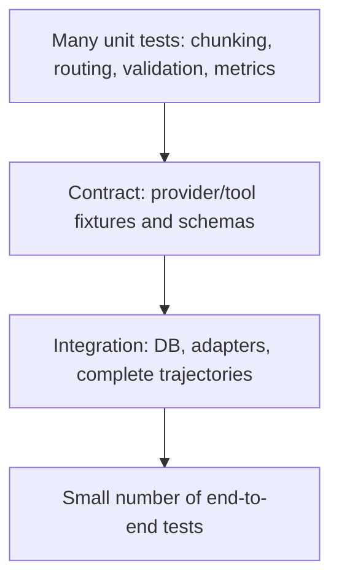

# Python, API, Data, and Testing Foundations

AI engineering interviews test software engineering because the model is only one dependency in a production system.

## Python and async

**`async` does not make CPU work faster.** It lets one thread make progress on other coroutines while awaiting I/O. Blocking SDK calls, PDF parsing, large tokenization, and local ML inference can still block the event loop. Move CPU-heavy work to workers/processes and use async-compatible network/database clients where concurrency matters.

**Generator versus list:** a generator yields values lazily, reducing memory and enabling streaming. Suvyon provider streams and agent streams use `Iterator[str]`, but a production stream must also handle disconnect, cancellation, partial results, timeout, and cleanup.

**Type hints:** improve contracts, editor/static analysis, and refactoring but do not validate runtime data by themselves. Pydantic validates API/config models at runtime.

**Dependency injection:** FastAPI dependencies supply authenticated users and database sessions without global coupling, making authorization and tests composable.

## API design

- Use resources and HTTP semantics consistently: `GET`, `POST`, `PATCH`, `DELETE`.
- Distinguish authentication (`401`) from insufficient authorization (`403`) and missing resources (`404`). Returning `404` can reduce resource enumeration across tenants.
- Validate body, path, query, upload size/type, and semantic constraints.
- Make mutations retry-safe with idempotency keys when clients or queues may retry.
- Version contracts and return structured, non-sensitive errors with a request ID.
- For long tasks return a job resource (`202 Accepted`) and expose status/progress rather than holding a request open.

Suvyon groups versioned routes under the FastAPI application in [router.py](../../backend/app/api/v1/router.py#L1) and separates schemas, services, and repositories.

## Transactions and SQL

An application transaction should preserve an invariant. For chat, think carefully about when the user message and assistant message commit if the provider fails. For ingestion, avoid exposing a partially built document index as ready.

Isolation concepts:

- Dirty read: observe uncommitted data.
- Non-repeatable read: a row changes between reads.
- Phantom read: a repeated range query returns different rows.
- Lost update: concurrent writers overwrite without coordination.

Use constraints for invariants the database can enforce, indexes for observed query patterns, and transactions for multi-step changes. Avoid N+1 ORM queries through eager loading/batching. Inspect query plans rather than guessing.

Suvyon's relational model puts resources below the workspace tenant root and uses cascading foreign keys. The vector query combines knowledge-base filtering with distance ranking in [vector_store.py](../../backend/app/rag/vector_store.py#L67).

## Authentication and authorization

- Passwords are hashed, never encrypted for later recovery.
- Access tokens should be short lived; refresh tokens need rotation/revocation strategy.
- JWT signing proves integrity, not confidentiality—the payload is readable.
- CORS is a browser policy, not authentication or server-side authorization.
- Every nested resource must be authorized from trusted identity to workspace/resource ownership.
- Secrets belong in a secret manager/environment, not source, prompts, errors, or traces.

## Testing pyramid for AI systems

Keep deterministic tests around nondeterministic models:

- Mock model/tool responses for orchestration paths.
- Record sanitized provider contract fixtures.
- Assert properties and schemas, not exact prose.
- Run a versioned offline evaluation set for semantic behavior.
- Add adversarial prompts and tenant-isolation/security cases.
- Use canary/shadow traffic and monitoring for production model changes.

Suvyon unit tests demonstrate deterministic testing of model routing, tool selection, email confirmation, chunking, and retrieval diversity in [backend/tests](../../backend/tests/).

## CI/CD and migrations

Run formatting/linting, type checks, unit/integration tests, security/dependency scans, and eval gates before deployment. Database migrations should be backward compatible during rolling deployments: expand schema, deploy code that tolerates both shapes, backfill, then contract later.

Prompt templates, tool schemas, chunking settings, embedding models, and model aliases are deployable configuration and should be versioned and regression-tested like code.

## Rapid-fire engineering questions

1. **Thread versus process?** Threads share memory and suit blocking I/O; processes isolate memory and bypass the GIL for CPU-heavy Python workloads at higher overhead.
2. **What is connection pooling?** Reusing a bounded set of database connections to avoid setup cost and protect the database from connection storms.
3. **What is backpressure?** Slowing/rejecting producers when downstream capacity is saturated instead of allowing unbounded queues and latency.
4. **Retry versus circuit breaker?** Retry handles transient failure; a circuit breaker stops repeated calls to an unhealthy dependency and later probes recovery.
5. **What is idempotency?** Repeating an operation with the same key has no additional effect beyond the first successful execution.
6. **Optimistic versus pessimistic locking?** Optimistic detects conflicts at write time; pessimistic locks records before modification.
7. **Why structured logging?** Machine-queryable fields support correlation, dashboards, and alerts better than unstructured strings.
8. **Unit versus integration test?** Unit tests isolate logic; integration tests verify boundaries such as the database or provider adapter.
9. **Why repository/service separation?** Repositories encapsulate persistence; services coordinate business rules and transactions, although unnecessary layers should be avoided for trivial code.
10. **What is an SLO?** A target for a measured service indicator, such as 99.9% successful requests or p95 latency below a threshold.

