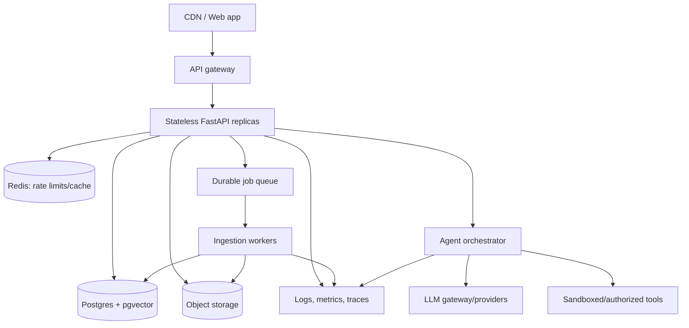
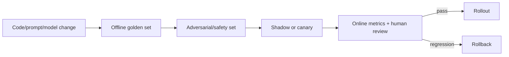

# Production GenAI System Design

## A repeatable interview structure

1. Clarify users, workload, freshness, actions, privacy, and success criteria.
2. State functional and non-functional requirements.
3. Estimate traffic, document volume, context/token load, latency, and cost.
4. Draw APIs, online request path, offline ingestion path, and data stores.
5. Deep-dive retrieval, orchestration, safety, evaluation, and failure handling.
6. Identify bottlenecks and an evolution plan.

## Production evolution of Suvyon

## Scalability and reliability

- Keep API replicas stateless; put conversation/run state in durable stores.
- Move parse/embed/index work to jobs; make every stage idempotent.
- Store original files durably and version index artifacts.
- Rate-limit per user/workspace/provider and enforce token/spend budgets.
- Cache only safe, version-aware results; never cross tenant boundaries.
- Use provider timeouts, exponential backoff with jitter, circuit breakers, and bulkheads.
- Stream responses, but persist a final committed message only after completion; handle cancellation and partial output explicitly.
- Apply backpressure when queues/providers saturate.

## Observability

Trace a request with correlation IDs across API, retrieval, model, and tool calls. Record model/provider/version, prompt-template version, token counts, latency, retrieved chunk IDs/scores, tool name/status, and evaluation signals. Redact secrets and sensitive content.

Key dashboards:

- availability, error rate, p50/p95/p99 latency, time to first token;
- tokens and cost per successful task;
- provider failover and rate-limit frequency;
- retrieval no-hit rate and source diversity;
- agent steps, tool failures, and confirmation violations;
- user feedback and regression-eval scores by release.

## Security threat model

| Boundary | Risk | Control |
|---|---|---|
| Browser → API | stolen/invalid identity, abuse | short-lived access token, refresh rotation/revocation, rate limit |
| Workspace data | cross-tenant access | ownership filters, database constraints/RLS, authorization tests |
| File ingestion | malware/parser bombs | content sniffing, size/page limits, sandbox/scanner |
| Retrieved text | indirect prompt injection | label as data, instruction hierarchy, tool restrictions |
| LLM provider | sensitive data leakage | minimization, redaction, provider policy, regional controls |
| Tool execution | side effects/exfiltration | least privilege, allowlists, approval, idempotency, audit |
| Logs/traces | secrets/PII retention | structured redaction, access control, retention limits |

## Cost model

Approximate per-request cost as input tokens × input price + output tokens × output price + embedding/search/tool costs. Agent loops multiply model calls. Control cost with smaller routing models, compact tool output, retrieval limits, history summarization, semantic/prefix caching where safe, and hard run budgets. Optimize cost per successful task, not cost per call.

## Evaluation and release gate

Version prompts, models, tool schemas, embeddings, chunking configuration, and evaluation data. A model or prompt change is a software release and needs regression testing.

## Design questions to rehearse

### Design a support RAG assistant

Clarify document freshness and ACLs. Build event-driven ingestion, hybrid retrieval with metadata filters, reranking, evidence-limited answering, citations, feedback, and separate retrieval/generation evals. Discuss deletion and permission propagation.

### Design a research agent

Define source policies and time budget. Use a planner or bounded workflow, parallel read-only searches, deduplication, source quality scoring, claim-to-source mapping, checkpoints, and a synthesis step. Prevent arbitrary browsing/actions and preserve provenance.

### Design an email agent

Separate drafting from execution. Resolve identity and recipients deterministically, show an exact preview, require confirmation tied to a content hash, send with an idempotency key, record an audit event, and report provider-confirmed status only.

### Scale Suvyon to 100k daily users

Avoid inventing exact numbers before clarifying concurrency and usage. Horizontally scale stateless APIs, queue ingestion, store files in object storage, pool database connections, partition/cache carefully, enforce provider budgets, add circuit breakers and observability, then use measurements to decide whether pgvector needs independent scaling.

